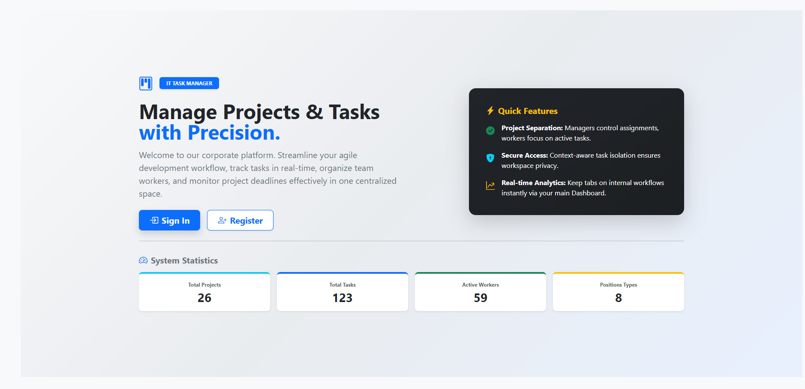

# IT Task Manager

A Django web application designed for task and project management within IT teams, featuring Role-Based Access Control (
RBAC) and clean UI.

## Check it out!

[IT Task Manager deployed to Render](https://it-task-manager-q62h.onrender.com)

## Getting Started

These instructions will get you a copy of the project up and running on your local machine for development and testing
purposes.

### Prerequisites

You need to have Python 3.12+

```bash
git clone [https://github.com/your-username/it-task-manager.git](https://github.com/PavelPereverzev1/it-task-manager.git)
cd it-task-manager
python3 -m venv venv
source venv/bin/activate
pip install -r requirements.txt
python manage.py runserver  # starts Django Server
```

## 🌟 Key Features

* **Role-Based Access Control (RBAC):**
    * **Managers:** Can create, update, and delete projects and tasks, as well as assign developers.
    * **Developers (Workers):** Have access to their personalized task lists and can update task execution statuses ("In
      Progress" / "Completed").
* **Project Management:** Seamless grouping of tasks by projects with custom interactive forms for bulk task attachment
  and detachment.
* **Dynamic Search & Pagination:** Fast server-side filtering for tasks, workers, and positions using dynamic text
  placeholders.
* **Responsive Forms:** Enhanced user experience utilizing custom Django form widgets, structured checkbox selections,
  and HTML5 `datetime-local` inputs.

---

## 📸 Demo

<p align="center">
  
</p>